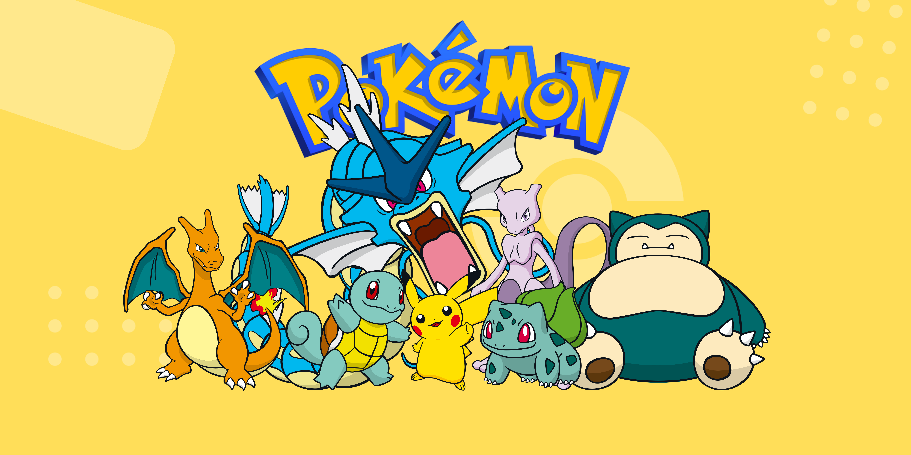
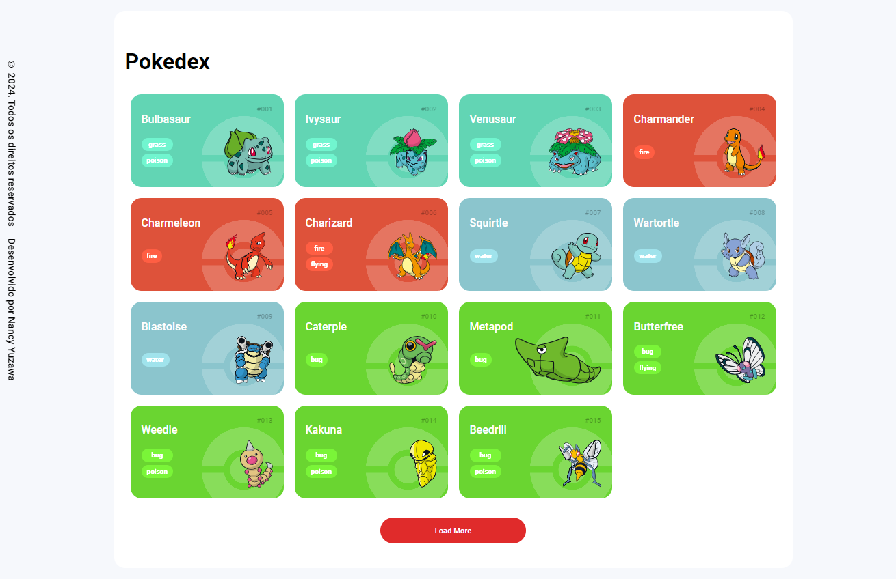
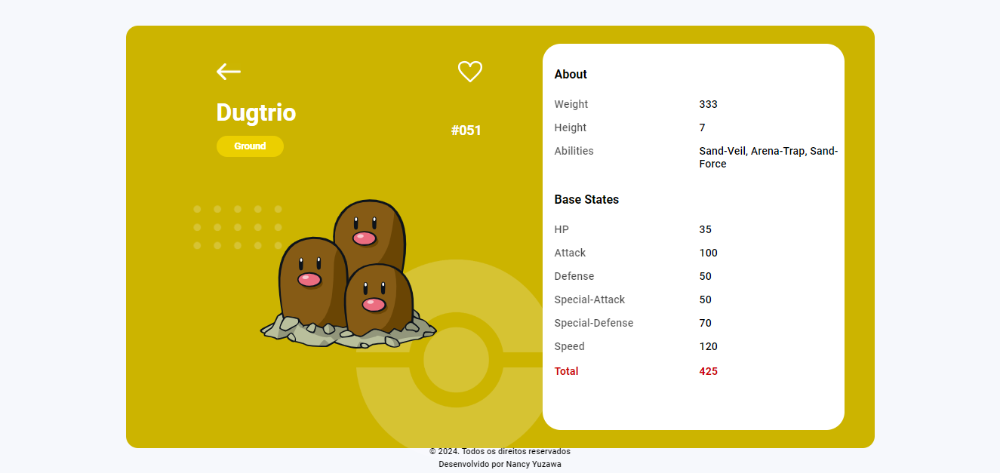

<h1>
	
	Pokedex
</h1>
<p align="center">
	Criação de uma enciclopédia de Pokémon através da API
</p>
<p align="center">
<h4 align="center"> 🚧 Pokedex 🚀 Concluído ✔️ 🚧</h4></p>
<p align="center">



<p align="center">
  
  
  <a href="https://github.com/tgmarinho/nlw1/commits/master">
    
  </a>
</p>


<p align="center">  
	<a href="#sobre">Sobre</a> • <a href="#demo">Demonstração da aplicação</a> • <a href="#preRequisitos">Pré-requisitos</a> • <a href="#tecnologias">Tecnologias</a> • <a href="#creditos">Creditos</a> • <a href="#licenca">Licença</a> 
</p>

<p align="center">
	<b>─── ⋆⋅⋅⋆ ───</b>
</p>

<h2 id="sobre">
	Sobre o projeto
</h2>
<p>
	Projeto desenvolvido durante o Bootcamp Coding The Future Banco PAN - Desenvolvimento Frontend com Angular.
</p>
<p>
	Em si, o programa é uma lista dos Pokémon da primeira geração, contendo 151 espécies. Ele abrange informações como:
	<ul>
		<li>
			ID;
		</li>
		<li>
			Tipo;
		</li>
		<li>
			Características: peso, altura e habilidades;
		</li>
		<li>
			Estatísticas básicas.
		</li>
	</ul>
</p>
<h2 id="demo">
	Demonstração da aplicação
	<h3>
		Mobile
		<p align="center">
			
		</p>
		Web
		<p align="center">
			
   		 	
		</p>
	</h3>
	
</h2>
<h2 id="preRequisitos">
	Pré-requisitos
</h2>
 Antes de começar, você vai precisar ter instalado em sua máquina as seguintes ferramentas: <a href="https://git-scm.com">Git</a>, <a href="https://nodejs.org/en/">Node.js</a> e um editor de código, como o <a href="https://code.visualstudio.com">VSCode</a>
<h2 id="tecnologias">
	Tecnologias
</h2>
<ul>
	<li>
		HTML5
	</li>
	<li>
		CSS3
	</li>
	<li>
		JavaScript
	</li>
	<li>
		Node.js
	</li>
	<li>
		Json da <a href="https://pokeapi.co">Poké API</a>
	</li>
</ul>

<h2 id="creditos">
	Créditos
</h2>
<ul>
	<li>
		Design do Pokedex para mobile: <a href="https://dribbble.com/shots/6540871-Pokedex-App">Saepul Nahwan</a>
	</li>
	<li>
		API usada: <a href="https://pokeapi.co">Poké API</a>
	</li>
	<li>
		Icones de Pokémon neste README: <a href="https://icons8.com.br/icons/set/pokedex">Icons8</a>
	</li>
</ul>

<p align="center">
	<b>─── ⋆⋅⋅⋆ ───</b>
</p>

## Pré-requisitos
Antes de começar, verifique se você possui as seguintes ferramentas instaladas em sua máquina:

* Git
* Node.js (que inclui npm, o gerenciador de pacotes do Node.js)
* Um editor de código, como Visual Studio Code


### Clone o repositório usando o Git

```bash
git clone https://github.com/nancyuzawa/Pokedex.git
```

### Entre na pasta do projeto
```bash
cd Pokedex
```
## Estrutura do projeto
* O projeto usa tecnologias como HTML5, CSS3, JavaScript e Node.js.
* Os dados são obtidos da API Poké API (https://pokeapi.co), usando JSON para recuperar informações sobre Pokémon.
* O projeto inclui demonstrações da aplicação para mobile e web, conforme mostrado nas imagens MobileDemonstration.gif, WebDemonstration1.png e WebDemonstration2.png.


<h2 id="licenca">
	Licença
</h2>
<p >
	Este projeto esta sobe a licença MIT.
</p>
</br>
</br>


<p align="center">
	Feito com ❤️ por Nancy Yuzawa. 
</p>
<p align="center">
	👋 <a href="https://www.linkedin.com/in/nancy-yuzawa">Entre em contato</a>
</p>
<div align = "center">🌿•₊✧💻⋆⭒˚☕️｡⋆</div>
